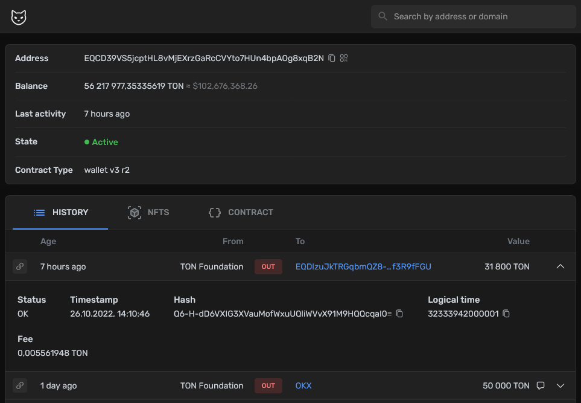
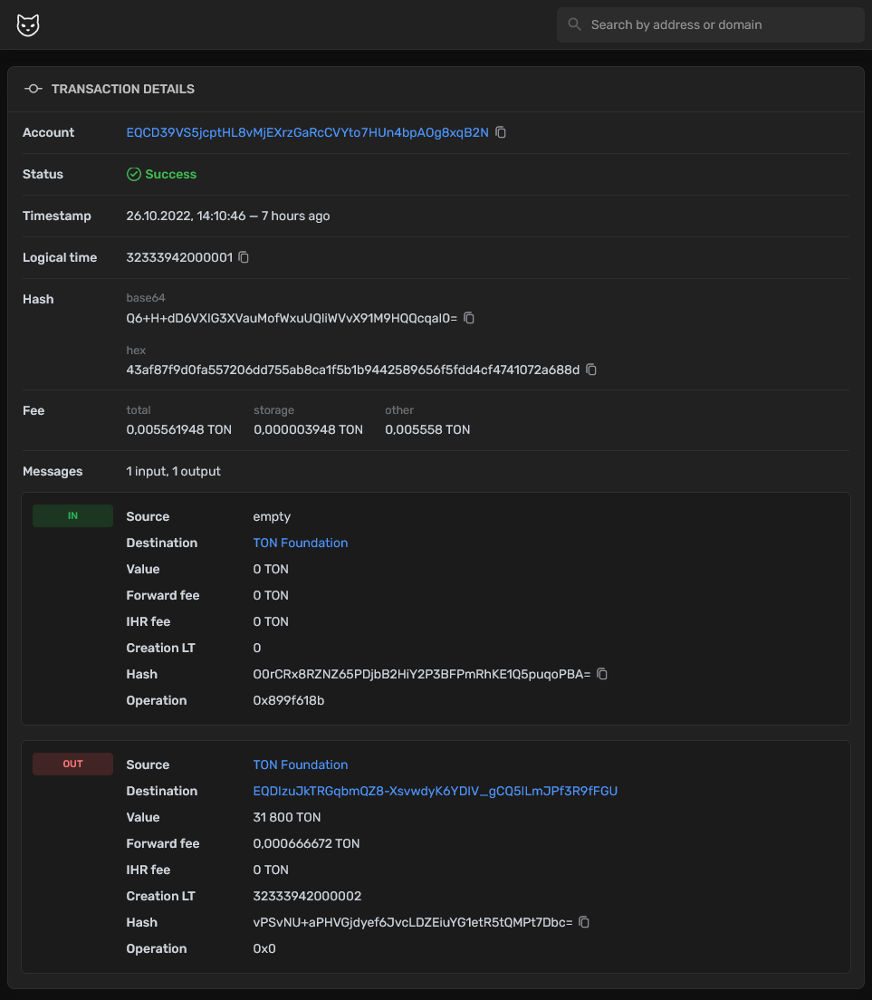
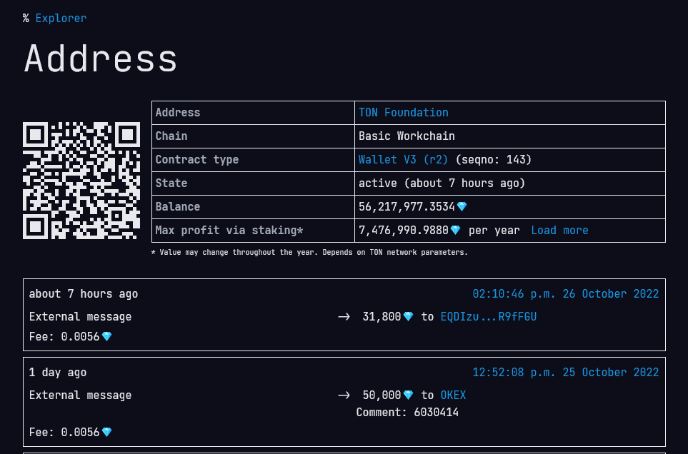
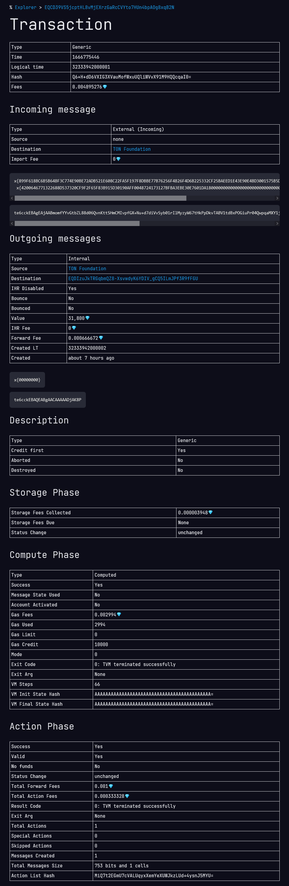
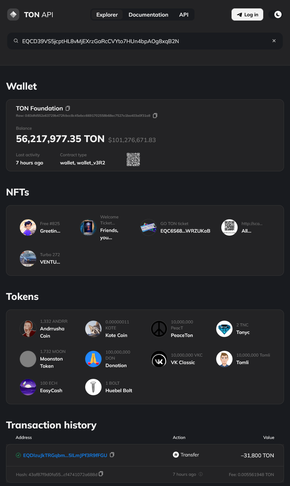
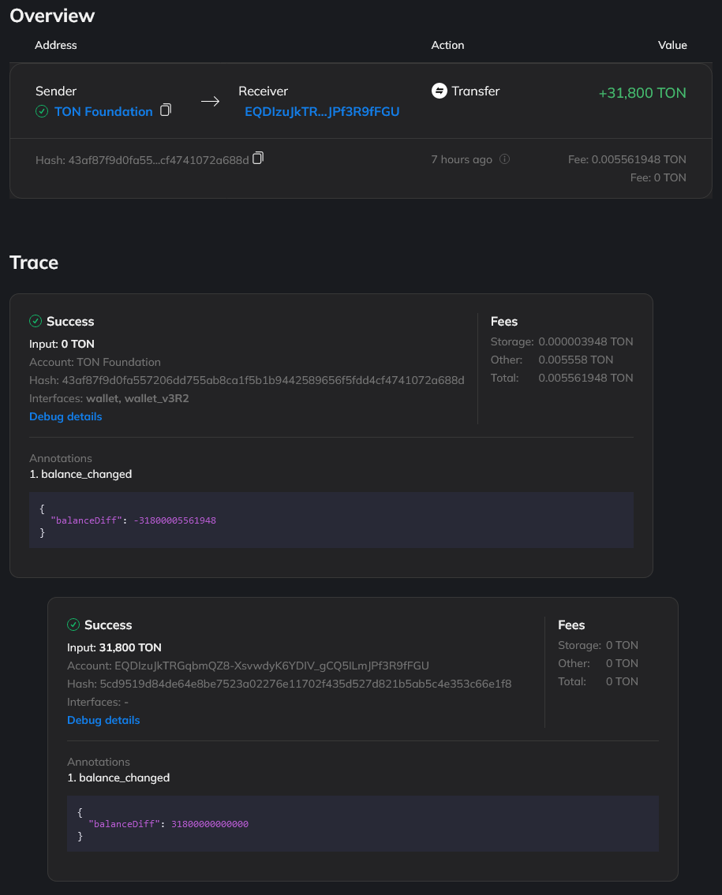

# Explorers in TON

In this article, we will consider TON explorers, their capabilities and features from the point of view of the developer.

## What is an explorer?

If you are new to the blockchain technology, here is some basic information:

Explorer is a website that allows you to view information in the blockchain, such as account balance, transaction history, blocks, etc.

## What explorers exist?

Among the TON explorers, you can distinguish several categories:

- For everyday use
- With extended information for developers
- Specialized

The division into categories is largely conditional, and one explorer can belong to several categories at the same time. So let's not pay too much attention to this.

## General functionality

Let's start with the general functionality that is present in all explorers.

Almost all explorers have the ability to find information about the balance, transaction history, and information about the smart contract, if any, deployed on this address by the address in the TON network.

Next, we will consider several explorers that can be attributed to each of the categories.

## TonScan Explorer

Good explorer for everyday use.

### Pros 👍

- Convenient for everyday use
- Convenient for developers
- Support for some smart contracts (DNS, NFT sale, jetton...)

### Cons 👎

- In the transaction history of jetton, the number of transferred jettons is not displayed

| base address info                  | transaction                       |
| ---------------------------------- | --------------------------------- |
|  |  |

- URL: https://tonscan.org/
- Testnet URL: https://testnet.tonscan.org/

## TonWhales Explorer

This explorer is more oriented towards developers than ordinary users.

Also, the TonWhales team supports its own network `sandbox`. This is both a plus and a minus. The plus is that you can test your smart contracts in this network, the minus is that all information about transactions in this network is not displayed in other explorers.

### Pros 👍

- Convenient for developers
- Support for its own network `sandbox`
- Ability to view the contract code directly on the site

### Cons 👎

- No redirection to the wallet by the TON DNS domain
- In the transaction history of jetton, the number of transferred jettons is not displayed

| base address info                      | transaction                           |
| -------------------------------------- | ------------------------------------- |
|  |  |

- URL: https://tonwhales.com/explorer
- Testnet URL: https://tonsandbox.com/explorer

## TonAPI Explorer

This explorer is the newest of the presented and has its own pleasant features.
For example, Trace. This feature allows you to see the entire sequence of transactions between smart contracts, even if subsequent transactions do not contain your address.

Transaction information is not as detailed as, for example, tonwhales.

### Pros 👍

- Convenient for developers
- Convenient for everyday use
- Jetton transaction history
- Trace
- More recognizable interfaces

### Cons 👎

- For detailed transaction information, it refers to the block explorer

| base address info                | transaction                     |
| -------------------------------- | ------------------------------- |
|  |  |

## TON NFT EXPLORER

<!-- :::caution draft
This is a concept article. We're still looking for someone experienced to improve it.
::: -->

### Pros 👍

### Cons 👎

## Want to be in this list?

Please, write to one of the [maintainers](/contribute/maintainers).

## References

Right now you could find most of the explorers in the Ton.App directory:

- [https://ton.app/explorers](https://ton.app/explorers)

 <!-- # Explorers
 
<!-- Explorers list:
- Tonscan
- Tonwhales
- TonAPI
- Nft tools
- Ton.cx
- Ton.sh -->
